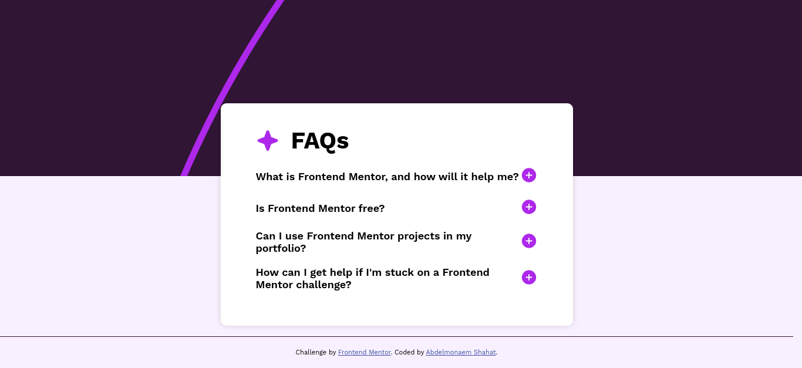

# Frontend Mentor - FAQ accordion solution

This is a solution to the [FAQ accordion challenge on Frontend Mentor](https://www.frontendmentor.io/challenges/faq-accordion-wyfFdeBwBz). Frontend Mentor challenges help you improve your coding skills by building realistic projects.

## Table of contents

- [Overview](#overview)
  - [The challenge](#the-challenge)
  - [Screenshot](#screenshot)
  - [Links](#links)
- [My process](#my-process)
  - [Built with](#built-with)
  - [What I learned](#what-i-learned)
  - [Continued development](#continued-development)
  - [Useful resources](#useful-resources)
- [Author](#author)

## Overview

### The challenge

Users should be able to:

- Hide/Show the answer to a question when the question is clicked
- Navigate the questions and hide/show answers using keyboard navigation alone
- View the optimal layout for the interface depending on their device's screen size
- See hover and focus states for all interactive elements on the page

### Screenshot



### Links

- Solution URL: [frontendmentor solution URL](https://your-solution-url.com)
- Live Site URL: [github pages live site URL](https://your-live-site-url.com)

## My process

### Built with

- Semantic HTML5 markup
- CSS custom properties
- Flexbox
- Javascript.

### What I learned

It is my first time to make an accordion with 100% accessibility and 100% SEO.

To see how you can add code snippets, see below:

```html
<!-- SEO tags -->
<meta
  name="description"
  content="Frequently Asked Questions about Frontend Mentor, a platform for frontend coding challenges."
/>
<meta
  name="keywords"
  content="accordion, FAQ,frontend, coding, challenges, html, css, javascript, portfolio"
/>
<meta name="author" content="Abdelmonaem Shahat" />
<meta name="robots" content="index, follow" />
<meta property="og:title" content="Frontend Mentor FAQs" />
<meta
  property="og:description"
  content="Frequently Asked Questions about Frontend Mentor, a platform for frontend coding challenges."
/>

<meta
  property="og:url"
  content="https://www.frontendmentor.io/challenges/faq-accordion-wyfFdeBwBz"
/>
<meta property="og:type" content="website" />
<div class="faq__item">
  <dt class="faq__question question flex items-center mb-2">
    <span class="question__text">Is Frontend Mentor free?</span>
    <button>
      
    </button>
  </dt>
  <dd class="faq__answer">
    <p>
      Yes, Frontend Mentor offers both free and premium coding challenges, with
      the free option providing access to a range of projects suitable for all
      skill levels.
    </p>
  </dd>
</div>
```

```css
@layer utilities {
  .max-w-lg {
    max-width: 60rem;
  }
  .text-center {
    text-align: center;
  }
  .mt-2 {
    margin-top: 2rem;
  }
  .mb-2 {
    margin-bottom: 2rem;
  }
  .my-2 {
    margin-top: 2rem;
    margin-bottom: 2rem;
  }
  .px-2 {
    padding-left: 2rem;
    padding-right: 2rem;
  }
  .py-2 {
    padding-top: 2rem;
    padding-bottom: 2rem;
  }
  .p-2 {
    padding: 2rem;
  }
  .mx-auto {
    margin-left: auto;
    margin-right: auto;
  }
  .my-0 {
    margin-top: 0;
    margin-bottom: 0;
  }
  .flex {
    display: flex;
  }
  .flex-column {
    flex-direction: column;
  }
  .items-center {
    align-items: center;
  }
  .justify-center {
    justify-content: center;
  }
  .h-screen {
    min-height: calc(100vh - 8rem);
    height: 100%;
  }
}
```

```js
const faqItems = document.querySelectorAll(".faq__item");
[...faqItems].forEach((item) => {
  item.addEventListener("click", function (e) {
    faqItems.forEach((item) => {
      item.lastElementChild.classList.remove("expand");
      item.firstElementChild.lastElementChild.innerHTML = ``;
    });
    this.lastElementChild.classList.add("expand");
    this.firstElementChild.lastElementChild.innerHTML = ``;
  });
});
```

### Continued development

I will focus again on `SEO` and `Accessibility`.

### Useful resources

- [AI Poe](https://poe.com) - This helped me for create the markup of the challenge. I really liked this pattern and will use it going forward.

## Author

- My Personal Site - [my portfolio](https://abdelmonaem-portfolio.vercel.app/)
- Frontend Mentor - [@coder-abdo](https://www.frontendmentor.io/profile/coder-abdo)
